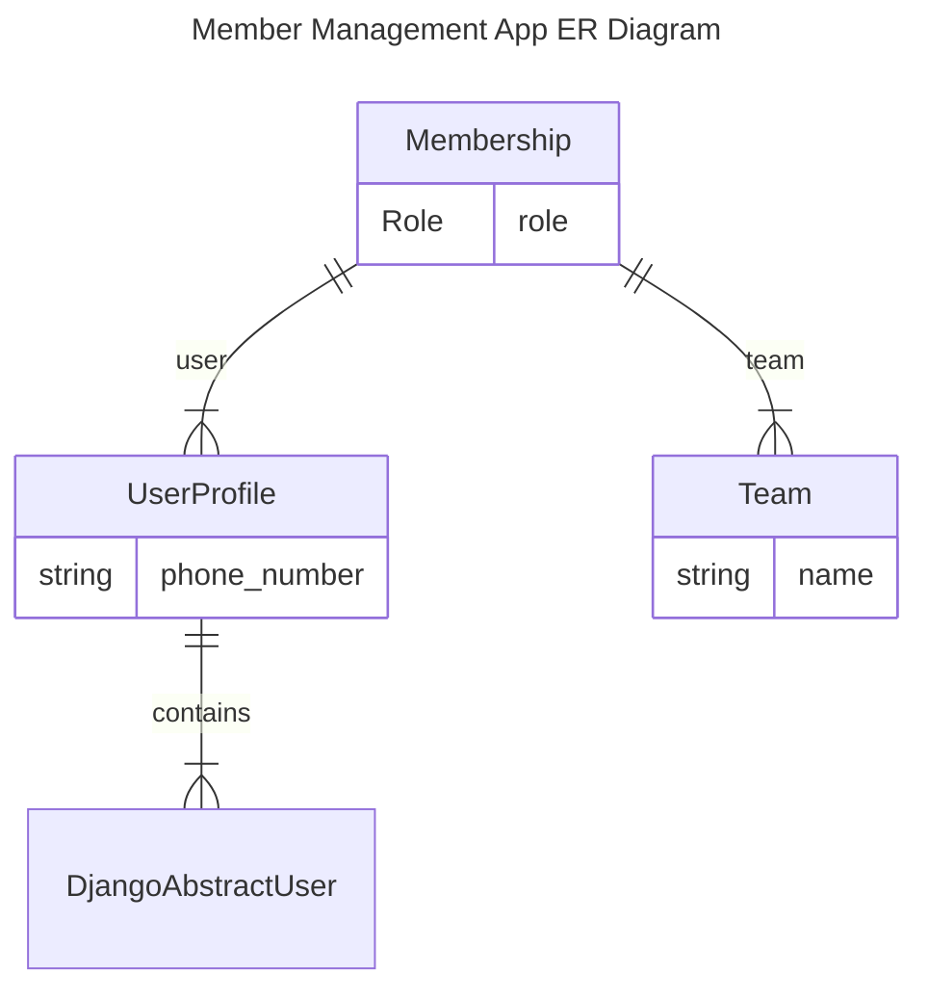
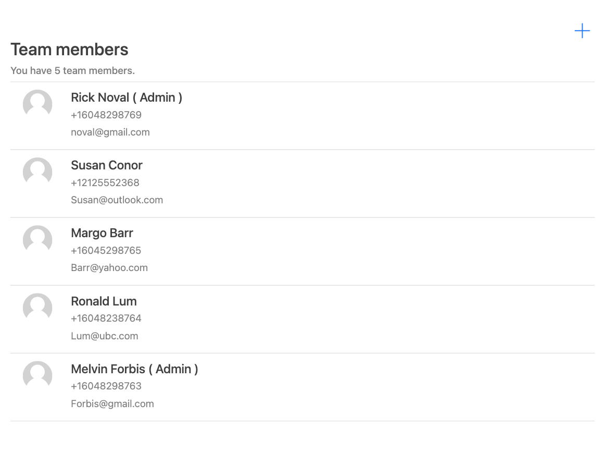
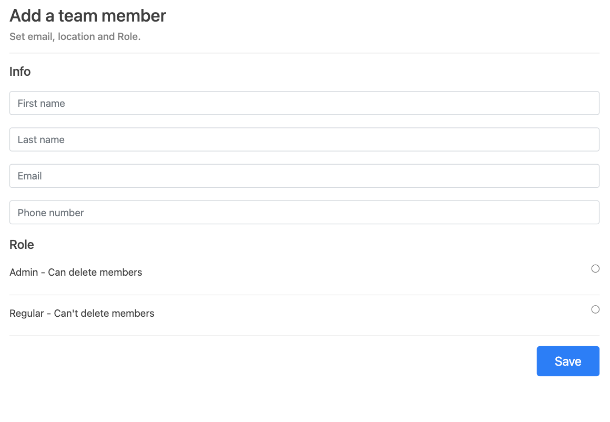
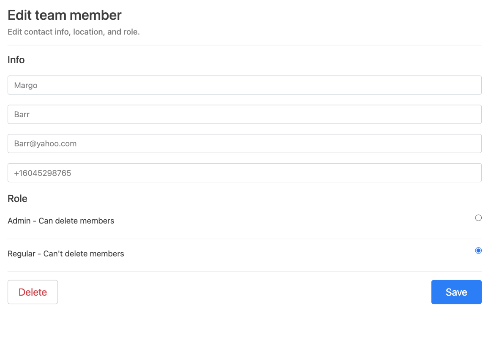

# Team Management Application

This is a a Django web application in which you can manage teams and its members. In the current version, users can add members with `Admin` or `Regular` Role to the application. Adding new teams currently is supported using the Django Admin.

## Database ER Diagram


## How to Test
This is a dockerized application with pre-populated database used for testing. For running the app, you need to run the following command:
```bash
docker build . -t team-management-app
docker run -d -p 8000:8000 team-management-app
```
It runs the application and populate the database with one `team` (with name: `course-team`) and 5 `users` which are the team's `members` with different roles. Users' username and password are in the table below:

| Username          | Password | Role    |
|-------------------|----------|---------|
| noval@gmail.com   | 1234     | Admin   |
| Susan@outlook.com | 1234     | Regular |
| Barr@yahoo.com    | 1234     | Regular |
| Lum@ubc.com       | 1234     | Admin   |
| Forbis@gmail.com  | 1234     | Admin   |

You can use each of this user's username, password to login to the system. Now, the app is being served on port `8000`.  Enter `http://127.0.0.1:8000/member-management/course-team/` in the browser. You need to login with one of the user's credentials. Then, you can see the `members' list page`.



Then if the current user is an admin it can add new member by clicking on the `+` button on top of the page. Then, you can see the `add new member page`.



By clicking on each user row in the member's list (if user is an admin), user can change the member's data or delete a member.

